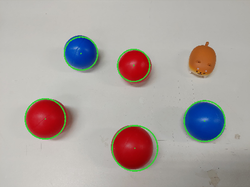

# OpenCV Training

## Ball Detection
1. Detect all the balls in the image.
    
 
    
    

2. Distinguish the color for each ball.
    
 
    
    

3. Count the number of balls for each color.
    
 
    
    
